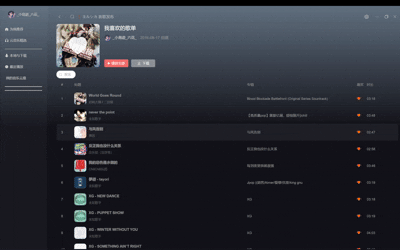

---

title: 如何优化复杂数据渲染列表的卡顿-1

date: 2025-12-03 

categories:
  - 音乐播放软件
tags:
  - Vue3
  - 性能优化

---


<br />
  最近在写一个模仿网易云音乐软件的项目,在写到音乐列表页面时碰到一个问题,可以看到我的这个音乐列表渲染的数据有点复杂，有个搜索当我在搜索时对数据过滤渲染，当我比如说清除搜索条件或者是删除搜索框最后一个字符时会卡顿一下再将数据加载出来
<br />

<br />

可以很清楚的看到明显的一个卡顿，那为什么会存在这个问题呢？首先我们先来看一下我最开始如何写的搜索代码
```javascript
 const filterList = ref<GetMusicDetailData[]>([])
  // 搜索音乐
 const handleSearch = (val) => {
   if (!val.trim().length) {
    filterList.value = mylist.value
   } else {
     filterList.value = mylist.value.filter((item) => {
       const alName = item.al?.name || ' '
       const keywords = [item.name?.toLowerCase(), alName.toLowerCase()]
      item.ar?.forEach((a) => {
         if (a.name) {
          keywords.push(a.name.toLowerCase())
         }
      })
       return keywords.some((keyword) => keyword.includes(val?.toLowerCase()))
     })
  }
 }

```
  这里我创建了一个filterList处理数组，然后对input进行监听 如果输入的全是空格或者没有值就全部渲染，否则就进行过滤将 歌曲名字专辑名歌手名当成关键词然后使用``Array.prototype.some``进行判断存在就渲染首先就是第一个可以优化的地方了,每次搜索都会创建一个keywords的数组，这里其实可以将这一步预处理
```javascript
mylist.value = props.list.map(item => ({
  ...item,
  _duration: formattingTime(item.dt),
  _searchText: [
    item.name?.toLowerCase() || '',
    item.al?.name?.toLowerCase() || '',
    ...(item.ar?.map(a => a.name?.toLowerCase() || '') || [])
  ].join(' ') //预处理搜索关键词
}))
```

  这样就减少没必要了重复操作，好了回归正题，为什么会出现卡顿呢？这就涉及到浏览器的渲染原理了，我们知道浏览器的**渲染主线程**是单线程的，这里卡顿实际上vue里面``keywords``和``filterList``已经是新数据了，但是由于数据量大和复杂，可能我听歌也不多我喜欢的音乐列表就300多条数据，如果其他上千的那会卡顿很久了，vue生成虚拟DOM然后 diff / patch ，更新真实DOM，浏览器之后才会重新渲染 ，这就阻塞了主线程的渲染从而导致卡顿。 

 正好提到了**js的单线程和浏览器渲染**我们再引申一下，讲一下我之前遇到的一个相关问题
```javascript
<template>
  <button @click="flag = !flag">切换</button>
  <div v-if="flag">
    显示
  </div>
  <div v-else ref="hideRef">
    隐藏
  </div>

</template>

<script setup lang="ts">
import { ref, watch } from 'vue'
const hideRef = ref<HTMLDivElement>()
const flag = ref<boolean>(true)
watch(flag, (newVal) => {
   if (!newVal) {
    hideRef.value.classList.add('hide')
   }
  
})

</script>
```

  这写了一个简单的demo，我们这里watch监听flag,当隐藏时给hideRef添加一个hide类，这力就有问题了，js从上到下依次执行，当我们执行到watch的时候flag是false往里面走,因为浏览器还没有将hideRef渲染出来，这里就对ref操作会报错，我们必须要让浏览器完成渲染后再进行操作，这里我们可以使用``nextTick/flush: 'post'``来等浏览器渲染完后再对ref操作

  这篇我们先了解了一下为什么会导致卡顿，提出了一个数据优化的技巧，了解了浏览器渲染的一些知识，下一章我们来看一下我是怎么处理该问题的。


