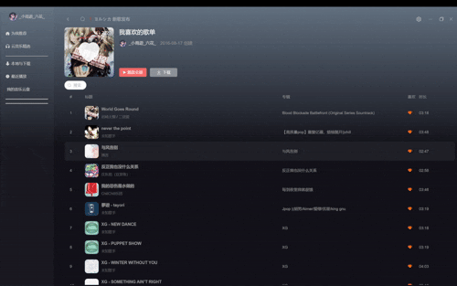

---

title: 如何优化复杂数据渲染列表的卡顿-2

date: 2025-12-05 

categories:
  - 音乐播放软件
tags:
  - Vue3
  - 性能优化

---

  上一篇我们讨论了如何优化数据渲染卡顿，这里我们来讨论一下如何优化数据渲染卡顿，通常我们可能会想到使用虚拟列表来处理
```javascript
<div class="content-box h-[calc(100%-80px)] overflow-auto overflow-y-auto px-[40px] pb-[80px]">
  <router-view v-slot="{ Component }">
    <component :key="refresh" :is="Component"></component>
  </router-view>
</div>
```
  由于我的``router-view`` 这块使用了calc来计算,electron可以改变窗口大小，而虚拟列表使用需要给出一个固定的高度，我这里使用不方便，所以我们必须另寻他路，上篇我们知道了导致卡顿的原因是渲染压力大，那我们从这里入手减小压力，我们听过大文件上传切片减小服务器的压力，这里我们一样，将列表的数据来分片渲染，我采用的是时间**分片（Time Slicing）**的优化思路，``RAF``来处理
```javascript
const chunkList = ref<GetMusicDetailData[]>([])
const chunkSize = 20
let rafId = 0
const renderChunked = (fullList: GetMusicDetailData[]) => {
  chunkList.value = []
  let start = 0
  cancelAnimationFrame(rafId)
  function appendChunk() {
    const next = fullList.slice(start, start + chunkSize)
    if (!next.length) return
    chunkList.value.push(...next)
    start += chunkSize
    rafId = requestAnimationFrame(appendChunk)
  }
  appendChunk()
}

watch(() => searchKey.value, (val) => {
  const key = val.trim().toLowerCase()
  renderChunked(
    key ? mylist.value.filter(item => item._searchText?.includes(key)) : mylist.value
  )
}, { immediate: true })
```
  首先我们创建一个chunkList存放我们的切片数据,这里我切片大小用了20,先看一下watch,先对searchKey进行监听，根据searchKey是否有值来将需要渲染的数据来切片，``immediate: true ``让页面首次加载时就渲染一次数据，然后我们来看我们切片函数，在每次执行时都先清空之前的数据，然后用个闭包``appendChunk``里面来将外面传来的fullList使用slice进行切片，如果next是空数组则说明切片已经完成return跳出函数，这里就到了我们这个函数的最重要的部分了，前面只是切片了，如何让他分块渲染呢？这里我使用到了``requestAnimationFrame``
  ``window.requestAnimationFrame() 方法会告诉浏览器你希望执行一个动画。它要求浏览器在下一次重绘之前，调用用户提供的回调函数。``这是我截取mdn上对``requestAnimationFrame``的介绍，让浏览器一帧完成一次我们的渲染，这样就减小了浏览器一次性渲染大量 DOM导致的压力，你可能会问那这么多次渲染浏览器重绘渲染这么多次会有性能问题吗？我这里将每次只处理20条数据可能只需要2ms，而浏览器有16ms来一帧渲染，而且更新的dom少回流重绘范围小这里不会产生性能问题。分块渲染不是减少回流，而是把“不可避免的巨大回流”拆成许多“小而快的回流”。只要每次更新足够小，就不会阻塞主线程，也不会掉帧，页面就会流畅。
之后就是其他问题的处理了，我们需要使用``cancelAnimationFrame``来取消之前的还在排队的RAF，来解决 出现旧数据混入、闪动、顺序错乱 现象，所以我们在调用``renderChunked``时都要将上一次的切片清空。
</br>

</br>
  我们可以清楚的看到相比之前这次的渲染十分流程，这样一个简单的分块渲染就完成了。