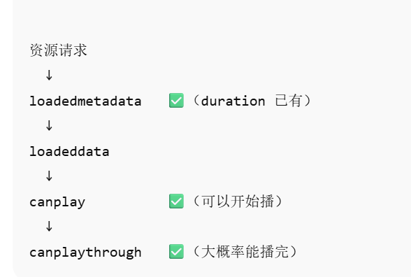

# 音乐播放功能实现


音乐播放器我们将这个组件拆分成 4块来看，左侧歌曲名称图片，中间控制audio的暂停播放切歌，右侧是音乐的长度和当前播放的时间还有音量，最后就是上面的进度条。

这章我们首先介绍中间部分控制音乐播放的实现和时间的实现

## 控制audio 的paly和pause

```javascript
<audio :src="props.src" ref="audio" class="plyr-audio" preload="auto" @timeupdate="timeupdate" />
 <DetaulCenter :orderStatus="orderStatus" :orderStatusVal="musicStore.orderStatusVal" :isPlay="isPlay" 			   @pause="pause" @play="play" @setOrderHandler="setOrderHandler" />
  
// 重写auido的暂停和播放
export type userAudio = {
  play: (lengthen?: boolean) => void;
  pause: (isNeed?: boolean, lengthen?: boolean) => void;
} & Omit<HTMLAudioElement, 'pause' | 'play'>  
// 播放状态
const isPlay = ref(false)
// 播放器实例
const audio = ref<userAudio>()
// 播放器原始播放和暂停
let originPlay: HTMLMediaElement['play']
let originPause: HTMLMediaElement['pause']

onMounted(() => {
  originPlay = audio.value!.play as HTMLMediaElement['play']
  originPause = audio.value!.pause as HTMLMediaElement['pause']
  audio.value!.play = play
  audio.value!.pause = pause

})
const userStore = useUserStore()
const musicStore = useMusicStore()
const play = (lengthen: boolean = false) => {


  originPlay.call(audio.value).catch((err) => {
    console.error('调用origin.play方法时抛出了错误：', err)
  })
  isPlay.value = true
}
const pause = (isNeed: boolean = true, lengthen: boolean = false) => {
  originPause.call(audio.value)
  isPlay.value = false
}
```

为了方便更好的控制`audio`我们创建一个ref来控制该实例，我们这里是重写了原生的**pause**和**play**方法，想在播放和暂停时有个过渡的效果，这里先将原生的播放和暂停存起来，调用的方法还是比较简单。

## audioTimeupdate的功能实现以及存储当前播放时间

为了方便我全局可以方便控制播放器这个组件我将 audio还有他的一些属性向外暴露出去写成了一个全局的$audio

```javascript
//MusicPlayer/index.vue
const exposeObj = {
  el: audio,
  isPlay,
  play,
  pause,

}
Object.defineProperty(exposeObj, 'time', {
  get(): number {
    return audio.value!.currentTime
  },
  set(time: number) {
    try {
      audio.value!.currentTime = time
    } catch (e) {
      console.error('设置time时出现了错误: ', e, ',time: ', time)
    }
  }
})
defineExpose(exposeObj)


// layout/index.vue

// 音乐播放器实例
const audioInstance = ref<MusicPlayerInstanceType>()
onMounted(async () => {
  if (audioInstance.value !== undefined) {
    window.$audio = audioInstance.value!
    console.log('初始化全局$audio：', window.$audio)
  }
  await getUserInfo()
})
```

这样我们在全局使用到该组件时可以通过window.$audio 来控制播放暂停。并且我们在通过``Object.defineProperty``在向外暴露的对象上加了一个time属性，方便我们来获取当前的currentTime和设置currentTime

好了回到我们要介绍的 timeupdate事件，当当前音频currentTime变化时会触发timeupdate的事件，在这里我们主要做的就是一件事就是将当前播放器的时间进行持久化存储

```javascript
//MusicPlayer/index.vue
<DetailRight :currentTime="musicStore.currentTime" :songs="props.songs" :audio="audio" />
  
const timeupdate = () => {
  musicStore.currentTime = window.$audio.time
}

onMounted(() => {
  const el = audio.value!

  el.addEventListener('loadedmetadata', () => {
    if (
      musicStore.currentTime > 0 &&
      musicStore.currentTime < el.duration
    ) {
      el.currentTime = musicStore.currentTime
    }
  })
})

//MusicPlayer/DetailRight.vue
 <div class="timeBox flex text-[15px]">
      <div v-if="props.songs?.ar" class="current-time">{{ formattingTime(props.currentTime * 1000) }}</div>
      <span style="margin: 0 5px;line-height: 24px">/</span>
      <div v-if="props.songs?.ar" class="total-time">{{ formattingTime(props.songs.dt) }}</div>
    </div>
```

这块我们主要来关注``onMounted``里面的,这里我们监听了loadedmetadata后再将audio的currentTime恢复这样保证了我们重启项目后可以保持之前的播放时间



有关timeUpdate那里可以使用节流优化优化一下，防止短时间多次改变store导致的性能问题

```javascript
const lastTime = ref(0)
const timeupdate = () => {
  if (timeState.stop || isNaN(window.$audio.el.duration)) { return }
  // 在更新 currentTime 之前，保存旧的值
  const now = Date.now()
  if (now - lastTime.value > 1000) {
    musicStore.currentTime = window.$audio.time
    lastTime.value = now
  }
}
```


