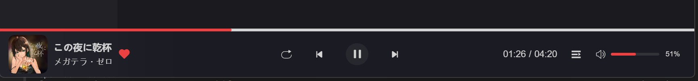
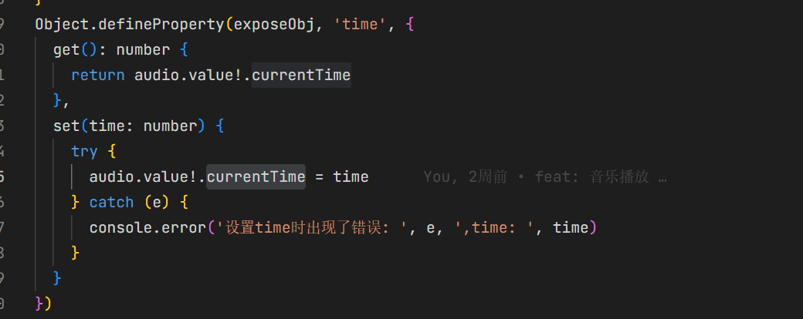

---

title: 音乐播放功能实现 - 2

date: 2026-02-05

categories:

  - 音乐播放软件

tags:

  - Vue3
  - 播放功能
  - 音量
  - 进度条

---

这次我们来继续介绍音量控制和进度条的实现



## 音量控制

```javascript
// useUserStore

//当前播放器的音量
    const volume = ref<number>(0.5)
    
    
// volume.vue
   <template>
    <div class="volume-box w-[150px] flex items-center">
      <i v-if="volume !== 0" class="iconfont icon-yinliang" @click="volumeHandler(true)" />
      <i v-else class="iconfont icon-jingyin" @click="volumeHandler(false)" />
      <el-slider v-model="model" :show-tooltip="false" @input="input" @change="change"
        style="width: 80px; overflow: hidden" />
      <div class="volume-value text-[12px] ml-[10px]">
        {{ model }}%
      </div>
    </div>
  </template>


  <script setup lang="ts">
  import { computed, ref, watch } from 'vue'
  import { useUserStore } from '@/store'
  import { userAudio } from '@/components/MusicPlayer/index.vue'

  interface Props {
    audio?: userAudio
  }

  const props = defineProps<Props>()
  const userStore = useUserStore()

  /** slider 的百分比值 */
  const model = ref(0)

  /** 真实音量 0 ~ 1 */
  const volume = computed(() => model.value / 100)


  /** 初始化 / audio 就绪时同步音量 */
  watch(
    () => props.audio,
    (audio) => {
     if (!audio) return
      const saved = userStore.volume
      const initVolume = Number.isNaN(saved) ? 1 : saved

      model.value = initVolume * 100
      audio.volume = initVolume
 
    },
    { immediate: true }
  )

  
  </script>
```

我们将音量先进行持久化存储，之后对父组件接收传来的``audio``实例进行监听并将值赋给它

```javascript
/** 统一设置音量的方法（核心） */
const setVolume = (v: number) => {
  if (!props.audio) return

  props.audio.volume = v
  userStore.volume = v
}
// 静音前的音量（0 ~ 1）
const beforeVolume = ref(1)

const volumeHandler = (mute: boolean) => {

  if (mute && volume.value > 0) {
    beforeVolume.value = volume.value
  }

  const target = mute
    ? 0
    : beforeVolume.value || 1

  model.value = target * 100
  setVolume(target)
}
/** 拖动 slider */
const input = () => {
  setVolume(volume.value)
}

/** 松手后同步到 store */
const change = () => {
  userStore.volume = volume.value
}
```

setVolume的函数 接收到传来的将值赋给audio和存到store，静音的话我们这里处理一下，在点击静音前我们将之前一次的音量存起来，这样从静音到点到非静音时可以恢复

## 进度条功能实现

```javascript
// ProgressBar.vue
<template>
  <div class="base-progress-bar w-full" v-if="props.songs?.ar">
    <el-slider
      :class="{ 'is-dragging': isSeeking }"
      v-model="slider"
      :show-tooltip="false"
      @input="onStart"
      @change="onEnd"

    />
  </div>
</template>

<script setup lang="ts">
import { GetMusicDetailData } from '@/types/musicList'
import { useMusicStore } from '@/store'
import { computed, ref } from 'vue'

interface Props {
  songs?: GetMusicDetailData
}
const props = defineProps<Props>()
const musicStore = useMusicStore()

/** 是否正在拖动 */
const isSeeking = ref(false)
/** 拖动时的临时时间 */
const tempTime = ref(0)

/** 歌曲总时长（秒） */
const duration = computed(() => {
  return (musicStore.songs?.dt ?? 0) / 1000
})

/** slider 百分比 */
const slider = computed<number>({
  get() {
    const time =  musicStore.currentTime

    return duration.value
      ? (time / duration.value) * 100
      : 0
  },
  set(val) {
    const time = (val * duration.value) / 100
    tempTime.value = time

  }
})

const onStart = () => {
  isSeeking.value = true

}

const onEnd = () => {

  isSeeking.value = false

  // 松手才真正设置 audio
  window.$audio.time = tempTime.value
  musicStore.currentTime = tempTime.value
}
</script>
```

这里的处理可以看一下在拖动的时候这里并没有直接给``audio.current``直接赋值而是在end的时候再进行赋值处理

`window.$audio.time = tempTime.value`这里的可以回顾一下我们第一章介绍的



audio.currentTime是双精度浮点型，所以musicStore里面的currentTime和我们设置的都必须是以秒为单位的，这里就可以理解我这里获取duration和在set里面Time的处理了