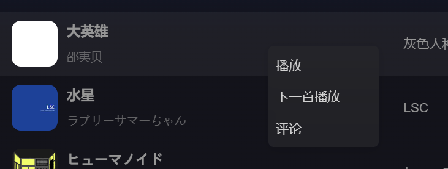
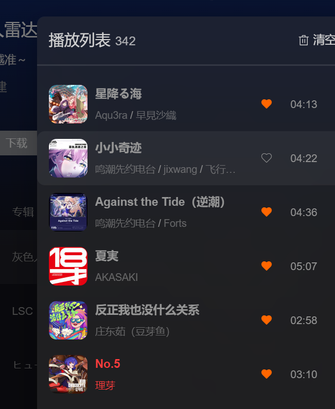

---

title: 一次音乐列表不更新的排查,让我更深入的了解了computed和watch

date: 2026-02-27

categories:

- 音乐播放软件
- 日常

tags:

- Vue3
- computed
- watch
- 响应式

---


## 问题描述

在做右键菜单的功能，点击播放，对正在播放的列表进行了处理，但是在当前播放列表展示里面并没有更新






## 问题分析

```javascript
// MusicDrawer.vue
 <MusicList :columns="drawerColumns" :list="runtimeTracks" :needSearch="false"
   :needTitle="false" type="drawerList" @play="handlePlay" />
     
const runtimeTracks = computed(() => {
  return Array.isArray(musicStore.runtimeList?.tracks)
    ? musicStore.runtimeList.tracks
    : []
})
  
// musicList.vue
  watch(() => props.list, (val) => {
  mylist.value = val.map(item => ({
    ...item,
    _duration: formattingTime(item.dt),
    _searchText: [
      item.name?.toLowerCase() || '',
      item.al?.name?.toLowerCase() || '',
      ...(item.ar?.map(a => a.name?.toLowerCase() || '') || [])
    ].join(' ') //预处理搜索关键词
  }))
  renderChunked(mylist.value)
}, { immediate: true })
```

一开始我怀疑是computed的问题 我在computed里面写了一个 log，在进行上述操作时并没有执行这个副作用，这里第一步其实就错了，我们先来了解一下computed这个函数

###  computed

我们知道computed是带缓存的、懒执行的，在computed初始化时首先会创建一个``effect``也就是我们computed箭头函数包括的，然后标记 **dirty = true** ，当我们访问这个computed时他会触发``getter`` 计算并缓存结果 后**dirty = false**，后续再次访问computed时如果dirty为false则继续使用缓存的值。

当响应式数据发生变化时``trigger(target, key)``会执行这个函数，去找到依赖改响应式数据的地方重新执执行``effect``，computed 则是标记 **dirty = true** ，当下次访问该computed 时再去内部处理。

然后再回到缓存这里，我们都知道computed依赖的是响应式对象，不管是ref还是reactive 都是对象，对象是复杂数据类型，在computed每次返回的都是一个引用，``Object.is(newValue, oldValue) === true``，我需要的都是``musicStore.runtimeList.tracks``新旧引用相同所以没有触发依赖更新也就没有执行打印log。

按照现在来说既然用的是引用那``runtimeTracks``也是最新值为什么列表没更新呢？

###  watch

watch函数依赖的响应式数据发生变化会执行watch的effect

watch 监听的方式有两种一直是直接监听响应式数据，另一种是监听getter返回的对象

```typescript
watch(() => props.list, (val) => {
 
}, { immediate: true )
    
watch(props.list, (val) => {
   
}, { immediate: true )
```

这两种写法，我们可以前往官方[watch](watch https://cn.vuejs.org/api/reactivity-core.html#watch )看看对于直接监听响应式数据如果是对象强制开启深度遍历，所以音乐列表没有更新的原因找到了，我们再加上**deep：true**就正常了

那可能会有疑问为什么说直接监听响应式数据会强制开启深度遍历那我用第二种写法不就好了，为什么要多次一举呢？

我们这里再来拓展一下Prop是``shallowReactive``浅层响应式

```javascript
const state = shallowReactive({
  foo: 1,
  nested: {
    bar: 2
  }
})

// 更改状态自身的属性是响应式的
state.foo++

// ...但下层嵌套对象不会被转为响应式
isReactive(state.nested) // false

// 不是响应式的
state.nested.bar++
```

所以只能是监听getter并手动加上**deep：true**


